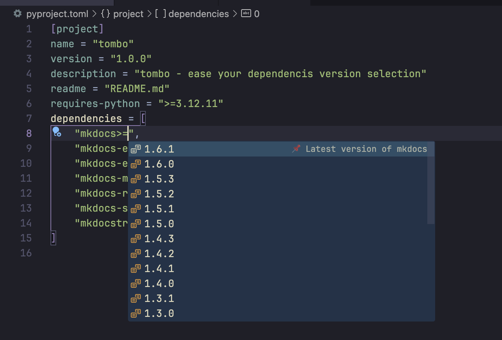

# Screenshots

See Tombo in action across all Python packaging formats! These screenshots demonstrate how Tombo provides consistent, intelligent package management regardless of your project setup.

## PEP 621 Format Support

Modern Python projects using the standardized `pyproject.toml` format.

### PyPI Integration in PEP 621

**What you're seeing:**

- Rich PyPI metadata display in PEP 621 `[project]` section
- Package information directly in your editor
- Clean integration with modern Python packaging standards
- Professional VS Code interface integration

### Version Management in PEP 621

**Features demonstrated:**

- Intelligent version constraint handling in dependency arrays
- Version suggestions and completion
- Clean, readable version display
- Native PEP 621 `dependencies = [...]` format support

## Poetry v1 Format Support

Classic Poetry project configuration with traditional dependency management.

### PyPI Integration in Poetry v1

**Poetry-specific features:**

- Package metadata in `[tool.poetry.dependencies]` section
- Poetry constraint syntax support (`^`, `~`, `>=`)
- Seamless Poetry workflow integration
- Rich hover information for Poetry projects

### Version Management in Poetry v1

**Poetry v1 capabilities:**

- Poetry-native version constraint completion
- Support for caret (`^`) and tilde (`~`) operators
- Poetry development dependencies support
- Clean integration with Poetry's dependency model

## Poetry v2 Format Support

Modern Poetry projects with enhanced syntax and parentheses format.

### PyPI Integration in Poetry v2

**Advanced Poetry features:**

- Poetry v2 parentheses syntax support
- Enhanced dependency group management
- Modern Poetry project structure
- Backward compatibility with Poetry v1

### Version Management in Poetry v2

**Poetry v2 enhancements:**

- Complex constraint expressions in parentheses
- Advanced version handling capabilities
- Mixed format compatibility
- Professional Poetry v2 workflow support

## Requirements.txt Format Support

Traditional pip requirements files - the foundation of Python packaging.

### PyPI Integration in Requirements Files

**Classic requirements support:**

- Rich package information in traditional `requirements.txt`
- Support for all requirements file variants (`requirements-dev.txt`, etc.)
- Comment preservation and formatting
- Universal pip compatibility

### Version Management in Requirements Files

**Requirements.txt capabilities:**

- All pip constraint operators (`>=`, `==`, `~=`, etc.)
- Multi-line requirements support
- Package name and version completion
- Clean, traditional pip workflow

## Universal Features Across All Formats

### Consistent Experience

Every screenshot demonstrates Tombo's commitment to providing a **consistent, high-quality experience** regardless of your Python packaging choice:

- **Same rich hover information** across all formats
- **Identical version completion quality** in PEP 621, Poetry, and requirements.txt
- **Consistent visual design** that integrates seamlessly with VS Code
- **Professional interface** that doesn't disrupt your workflow

### Format-Agnostic Intelligence

Notice how Tombo provides the **same level of intelligence** whether you're using:

- Modern PEP 621 `[project]` sections
- Poetry's `[tool.poetry.dependencies]`
- Classic `requirements.txt` files

### Real-World Projects

These screenshots capture Tombo in **actual development scenarios**:

- Working with popular packages like `mkdocs` and `colorama`
- Real version numbers and constraints
- Authentic development workflows
- Professional project structures

## Key Observations

### Package Information Quality

All screenshots show Tombo's ability to provide **comprehensive package metadata**:

- Latest version information
- Release dates and version history
- Python compatibility requirements
- Direct links to PyPI and documentation

### Version Constraint Intelligence

Across all formats, Tombo demonstrates **smart version handling**:

- Context-aware version suggestions
- Compatibility indicators
- Support for all constraint operators
- Real-time completion as you type

### Visual Consistency

Every screenshot maintains **VS Code's design language**:

- Native hover tooltips and completion dropdowns
- Consistent color schemes and typography
- Clean, unobtrusive interface elements
- Professional development environment feel

## Screenshot Technical Details

### Capture Settings
- **VS Code Theme**: Dark+ (default dark) for optimal contrast
- **Font**: JetBrains Mono for clear code readability
- **Extensions**: Only Tombo enabled to show pure functionality
- **Projects**: Real-world examples with authentic dependencies

### File Organization
Screenshots are organized by format for easy navigation:

- `assets/pep621/` - Modern Python packaging
- `assets/poetry_v1/` - Classic Poetry projects
- `assets/poetry_v2/` - Modern Poetry projects
- `assets/requirements/` - Traditional pip requirements

## Next Steps

Ready to experience these features yourself?

1. **[Install Tombo](../getting-started/installation.md)** - Get started in minutes
2. **[Try the quick start](../getting-started/quick-start.md)** - Hands-on tutorial
3. **[Explore examples](../examples/pep621.md)** - Learn format-specific features

!!! info
    **Watch video demos** - preparing!

---

!!! tip "Want to Create Similar Screenshots?"
    Check out our [contributing guide](../development/contributing.md) for best practices on documentation contributions and capturing screenshots.

These screenshots demonstrate that **Tombo truly delivers on its promise**: intelligent Python package management that works seamlessly across all Python packaging formats, providing a consistent, professional experience in VS Code! 🐍✨
